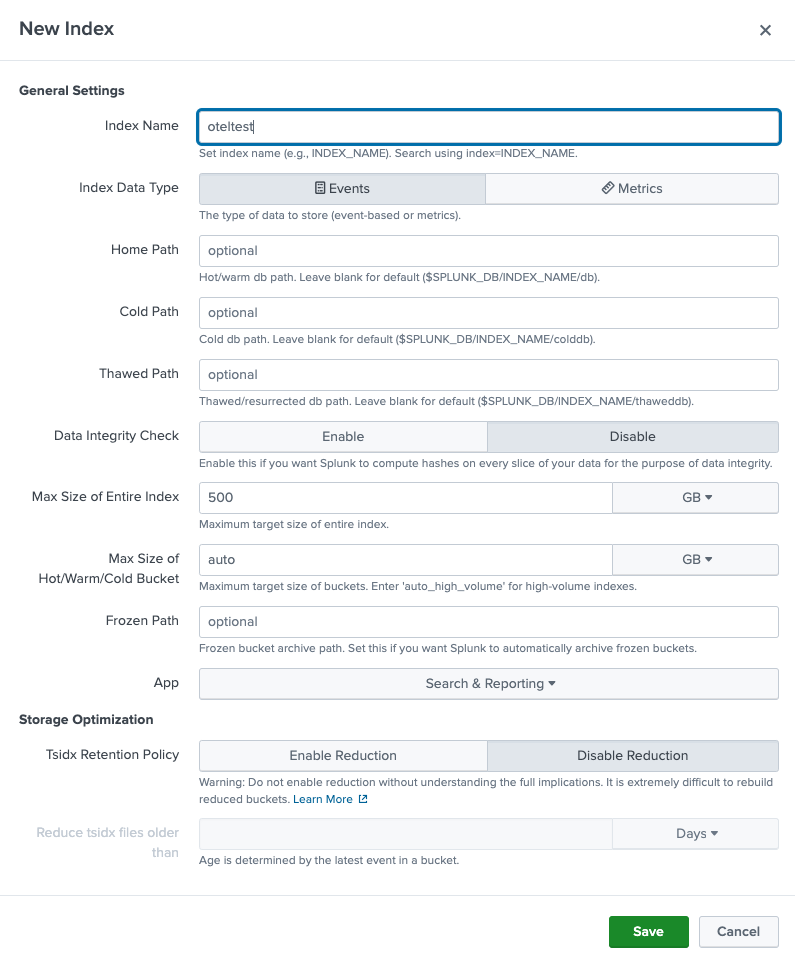
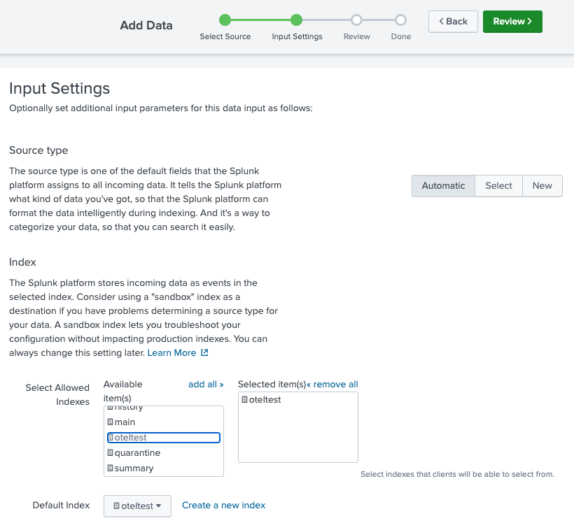
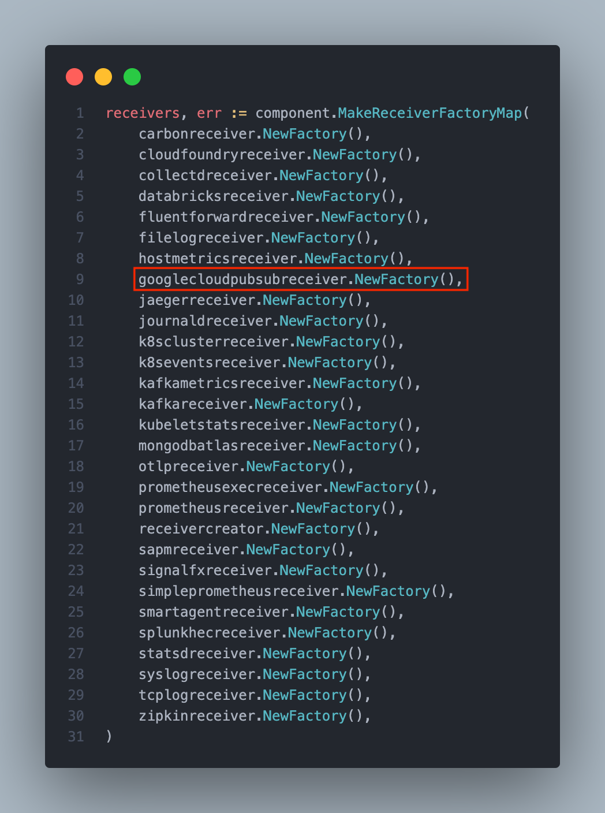
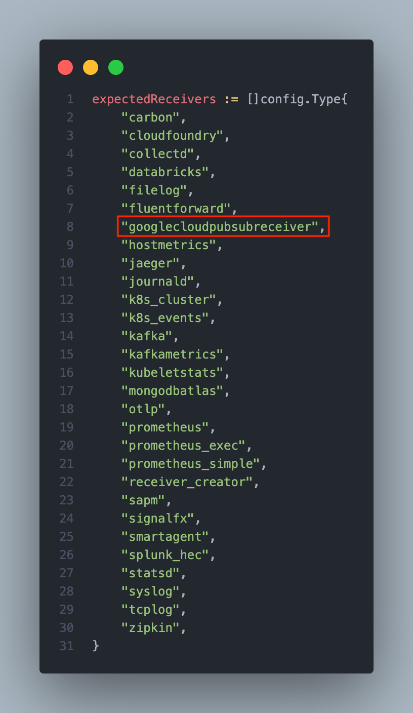
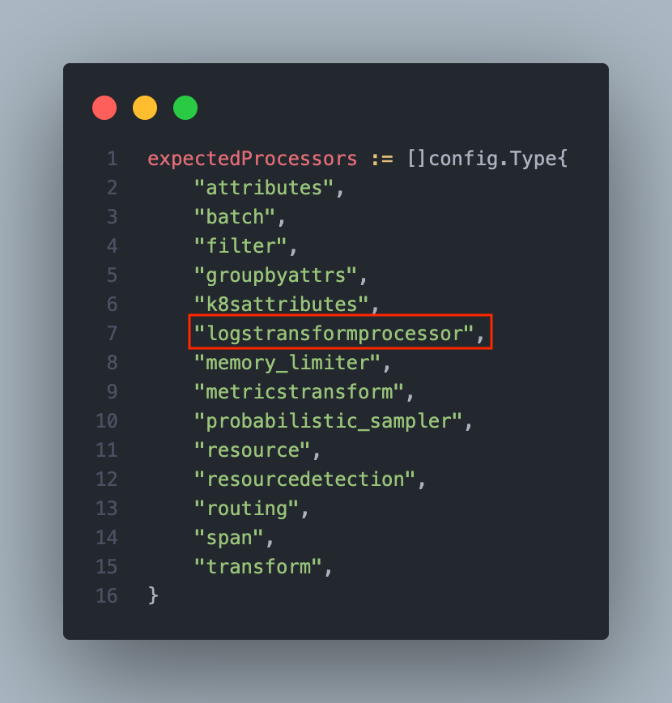

# Extending the Splunk OpenTelemetry distribution

The [Splunk OpenTelemetry Collector](https://github.com/signalfx/splunk-otel-collector) is a distribution of the [OpenTelemetry Collector](https://github.com/open-telemetry/opentelemetry-collector) built to provide a unified way for our customers to receive, process, and export metric, trace, and log data to Splunk Cloud and Splunk Observability products. While Splunk provides support for a wide variety of OpenTelemetry components, unusual use cases or newer and less stable components aren't enabled by default in our distribution. If you find yourself wanting to experiment with an unsupported use case, extending the Splunk distribution is relatively straightforward even for someone without an extensive development background.

In this article, I will demonstrate such an experiment by extending the Splunk OpenTelemetry collector to transport Google Cloud log messages from a Pub/Sub subscription to a Splunk HTTP Endpoint Collector (HEC). Specifically, I will cover the following steps:

- Configuring a Google Cloud log sink to publish audit log messages to a Pub/Sub topic
- Creating a Pub/Sub subscription to the aforementioned Pub/Sub topic
- Creating a service account with subscriber permission to the aforementioned subscription
- Exporting a JSON service account key for use with the OpenTelemetry Pub/Sub receiver
- Creating a Splunk index for Google Cloud log messages
- Creating a HEC token for use with the OpenTelemetry HEC exporter
- Customizing the Splunk OpenTelemetry source code to include support for the `googlecloudpubsubreceiver` and `logstransformprocessor` components
- Compiling and building a custom OpenTelemetry agent binary
- Building a rpm or deb package of the Splunk OpenTelemetry distribution
- Configuring the agent to receive Google Cloud log messages via Pub/Sub and deliver them to Splunk as HEC messages

## Caveats

- This is an experimental approach and should not be used in a production environment. **You will not receive support from Splunk or Google Cloud**. For information on deploying a production-ready Google Cloud log export to Splunk, please refer to [official Google Cloud documentation](https://cloud.google.com/architecture/deploying-production-ready-log-exports-to-splunk-using-dataflow). 
- Custom distributions can also be built with the [OpenTelemetry Collector Builder](https://github.com/open-telemetry/opentelemetry-collector/tree/main/cmd/builder). Splunk has not yet migrated to using the builder and the process won't be covered here.

## Prerequisites

* You aren't afraid of the CLI
* You aren't afraid to compile your own code
* A working [Go development environment](https://go.dev/doc/install)
* [Optional] Docker or podman installed in development environment
* A Splunk instance with [Splunk Add-on for Google Cloud Platform](https://splunkbase.splunk.com/app/3088/) installed

## Setup

### Google Cloud

The following steps cover Google Cloud setup. Please ensure these commands are run within the context of a non-production project that is safe to use for experimentation. It is highly recommended that you create a dedicated Google Cloud project for the purposes of this exercise. For example, to create and new project titled "oteltest" and switch configuration contexts to this new project, issue the following commands:

```
$ gcloud projects create oteltest
Create in progress for [https://cloudresourcemanager.googleapis.com/v1/projects/oteltest].
Waiting for [operations/cp.6929380012186718041] to finish...done.    
Enabling service [cloudapis.googleapis.com] on project [oteltest]...
Operation "operations/acat.p2-71306234863-65849f18-f411-45ec-8958-42f23f80d148" finished successfully.
$ gcloud config set project oteltest
Updated property [core/project].
```

#### Export variables

Create or identify an existing Google Cloud project which can be used for this experiment. Export its name into an environment variable. Ensure this variable is set to the `projectId` as listed in the output `gcloud projects list --format=flattened`. For example:

```
$ gcloud projects list --format=flattened
---
createTime:     2022-06-30T21:56:08.101Z
lifecycleState: ACTIVE
name:           oteltest
parent.id:      560850384093
parent.type:    organization
projectId:      oteltest
projectNumber:  71306234863
---
...
```

```
$ export GOOGLE_CLOUD_PROJECT=oteltest

```

Please note that `projectId` is not always the same as `name`.

Next, export the following shell variables.

```
$ export SERVICE_ACCOUNT_SHORT=otel-test
$ export SERVICE_ACCOUNT_FULL=${SERVICE_ACCOUNT_SHORT}@${GOOGLE_CLOUD_PROJECT}.iam.gserviceaccount.com
$ export SERVICE_ACCOUNT_FILENAME=gcp.json
$ export SINK_NAME=otel-log-sink
$ export PUBSUB_TOPIC=otel-log-topic
$ export PUBSUB_SUB=otel-log-sub
```

#### Create a service account

```
$ gcloud iam service-accounts create ${SERVICE_ACCOUNT_SHORT}
```

#### Export JSON key

```
$ gcloud iam service-accounts keys create ${SERVICE_ACCOUNT_FILENAME} \
--iam-account=${SERVICE_ACCOUNT_FULL}
```

#### Enable Pub/Sub API

```
$ gcloud services enable pubsub.googleapis.com
```

#### Create Pub/Sub topic

```
$ gcloud pubsub topics create ${PUBSUB_TOPIC}
```

#### Create Pub/Sub subscription

```
$ gcloud pubsub subscriptions create \
  --topic ${PUBSUB_TOPIC} ${PUBSUB_SUB}
```   

#### Bind role to service account

```
$ gcloud pubsub subscriptions add-iam-policy-binding ${PUBSUB_SUB} \
--member="serviceAccount:${SERVICE_ACCOUNT_FULL}" \
--role="roles/pubsub.subscriber"
```

#### Create log sink

The following command will create a log router that matches basic cloud audit logs along with a custom log.

```
$ gcloud logging sinks create ${SINK_NAME} \
pubsub.googleapis.com/projects/${GOOGLE_CLOUD_PROJECT}/topics/${PUBSUB_TOPIC} \
--log-filter='log_id("cloudaudit.googleapis.com/activity") OR log_id("cloudaudit.googleapis.com/policy") OR log_id("custom.googleapis.com/oteltest")'
```

#### Allow sink writer permission to topic


First, determine the identity of the log sink writer.

```
$ export SINK_SERVICE_ACCOUNT=`gcloud logging sinks describe ${SINK_NAME} --format="value(writerIdentity)"`
```

Next, grant the log writer service account identity permission to publish to the topic.

```
gcloud pubsub topics add-iam-policy-binding ${PUBSUB_TOPIC} \
 --member="${SINK_SERVICE_ACCOUNT}" --role="roles/pubsub.publisher"
```

### Splunk

The following steps will create a Splunk index and HEC token. You must have administrative permissions to perform these operations. The index name and HEC token will be referenced in later steps.

#### Create the index

Click the "Settings" menu in the top right corner.

Under the "Data" column, click on "Indexes".

Click the "New Index" button in the top right corner.

In the "Index Name" field, enter "oteltest".



Click "Save".

#### Create HEC token

Click the "Settings" menu in the top right corner. Under the "Data" column, click on "Data inputs".

In the "HTTP Event Collector" row, click the "Add new" button under the "Actions" column.

In the "Name" field, type "otelhec".

Click the "Next" button in the top right corner.

In the "Select Allowed Indexes" section, choose the "oteltest" item in the "Available item(s)" box. You should see "oteltest" appear in the "Selected item(s)" box. You should also see the "Default Index" update to "oteltest".



Click the "Review" button in the top right corner.

Click the "Submit" button in the top right corner.

Copy the "Token Value" to a text file for later use. 

In your development environment, export this token as an environment variable.

```
$ export SPLUNK_HEC_TOKEN=<token>
```

## Build

### Preparing the source

The basic steps for preparing the source code are as follows:

- Clone the Splunk OpenTelemetry distribution from Github
- Add new components to the import in `internal/components/components.go`
- Add new components to `Get` function in `internal/components/components.go`
- Update tests by adding components to `TestDefaultComponents` function in `internal/components/components_test.go`


### Clone the Splunk OpenTelemetry Distribution

```
$ git clone https://github.com/signalfx/splunk-otel-collector
Cloning into 'splunk-otel-collector'...
remote: Enumerating objects: 11502, done.
remote: Counting objects: 100% (464/464), done.
remote: Compressing objects: 100% (290/290), done.
remote: Total 11502 (delta 216), reused 333 (delta 166), pack-reused 11038
Receiving objects: 100% (11502/11502), 5.81 MiB | 14.94 MiB/s, done.
Resolving deltas: 100% (6990/6990), done.
```

```
$ cd splunk-otel-collector
```

### Install tools

The `Makefile` included with Splunk's OpenTelemetry distribution includes a target which installs prerequisite build tooling. Make sure you run this command to prepare your local development environment.

```
$ make install-tools
go install github.com/client9/misspell/cmd/misspell@v0.3.4
go install github.com/golangci/golangci-lint/cmd/golangci-lint@v1.45.0
go install github.com/google/addlicense@v0.0.0-20200906110928-a0294312aa76
go install github.com/jstemmer/go-junit-report@v0.9.1
go install github.com/ory/go-acc@v0.2.8
go: downloading github.com/ory/go-acc v0.2.8
go: downloading golang.org/x/sys v0.0.0-20220319134239-a9b59b0215f8
go install github.com/pavius/impi/cmd/impi@v0.0.3
go: finding module for package github.com/kisielk/gotool
go: found github.com/kisielk/gotool in github.com/kisielk/gotool v1.0.0
go install github.com/tcnksm/ghr@v0.14.0
go install golang.org/x/tools/go/analysis/passes/fieldalignment/cmd/fieldalignment@latest
...
```

### Edit source

Because the `googlecloudpubsubreceiver` receiver and the `logstransform` processor are not enabled by default with the Splunk distribution, I will need to enable the components in the source code and create a custom build based upon these changes. I've provided `diff` examples below to illustrate the changes made along with screenshots highlighting the necessary changes.

#### `internal/components/components.go`

The following is a diff demonstrating the changes made to `internal/components/components.go`:

```
diff --git a/internal/components/components.go b/internal/components/components.go
index 398ba46..40ab407 100644
--- a/internal/components/components.go
+++ b/internal/components/components.go
@@ -34,6 +34,7 @@ import (
        "github.com/open-telemetry/opentelemetry-collector-contrib/processor/filterprocessor"
        "github.com/open-telemetry/opentelemetry-collector-contrib/processor/groupbyattrsprocessor"
        "github.com/open-telemetry/opentelemetry-collector-contrib/processor/k8sattributesprocessor"
+       "github.com/open-telemetry/opentelemetry-collector-contrib/processor/logstransformprocessor"
        "github.com/open-telemetry/opentelemetry-collector-contrib/processor/metricstransformprocessor"
        "github.com/open-telemetry/opentelemetry-collector-contrib/processor/probabilisticsamplerprocessor"
        "github.com/open-telemetry/opentelemetry-collector-contrib/processor/resourcedetectionprocessor"
@@ -46,6 +47,7 @@ import (
        "github.com/open-telemetry/opentelemetry-collector-contrib/receiver/collectdreceiver"
        "github.com/open-telemetry/opentelemetry-collector-contrib/receiver/filelogreceiver"
        "github.com/open-telemetry/opentelemetry-collector-contrib/receiver/fluentforwardreceiver"
+       "github.com/open-telemetry/opentelemetry-collector-contrib/receiver/googlecloudpubsubreceiver"
        "github.com/open-telemetry/opentelemetry-collector-contrib/receiver/hostmetricsreceiver"
        "github.com/open-telemetry/opentelemetry-collector-contrib/receiver/jaegerreceiver"
        "github.com/open-telemetry/opentelemetry-collector-contrib/receiver/journaldreceiver"
@@ -112,6 +114,7 @@ func Get() (component.Factories, error) {
                fluentforwardreceiver.NewFactory(),
                filelogreceiver.NewFactory(),
                hostmetricsreceiver.NewFactory(),
+               googlecloudpubsubreceiver.NewFactory(),
                jaegerreceiver.NewFactory(),
                journaldreceiver.NewFactory(),
                k8sclusterreceiver.NewFactory(),
@@ -160,6 +163,7 @@ func Get() (component.Factories, error) {
                filterprocessor.NewFactory(),
                groupbyattrsprocessor.NewFactory(),
                k8sattributesprocessor.NewFactory(),
+               logstransformprocessor.NewFactory(),
                memorylimiterprocessor.NewFactory(),
                metricstransformprocessor.NewFactory(),
                probabilisticsamplerprocessor.NewFactory(),
```

Add the `logstransformprocessor` and `googlecloudpubsubreceiver` imports to `internal/components/components.go` as highlighted in the screenshot below.


In the same file, within the `Get` function, add `googlecloudpubsubreceiver.NewFactory()` to the `receivers` variable declaration as seen in the screenshot below.



Similarly, within the `Get` function, add `logstransformprocessor.NewFactory()` to the `processors` variable declaration as seen in the screenshot below.


#### `internal/components/components_test.go`

The following is a diff demonstrating the changes made to `internal/components/components_test.go`:

```
diff --git a/internal/components/components_test.go b/internal/components/components_test.go
index c7ee470..df10571 100644
--- a/internal/components/components_test.go
+++ b/internal/components/components_test.go
@@ -46,6 +46,7 @@ func TestDefaultComponents(t *testing.T) {
                "databricks",
                "filelog",
                "fluentforward",
+               "googlecloudpubsubreceiver",
                "hostmetrics",
                "jaeger",
                "journald",
@@ -75,6 +76,7 @@ func TestDefaultComponents(t *testing.T) {
                "filter",
                "groupbyattrs",
                "k8sattributes",
+               "logstransformprocessor",
                "memory_limiter",
                "metricstransform",
                "probabilistic_sampler",
```

Within the `TestDefaultComponents` function in `internal/components/components_test.go`, add `googlecloudpubsubreceiver` to the `expectedReceivers` variable declaration as seen in the screenshot below.



Similarly, within the `TestDefaultComponents` function in `internal/components/components_test.go`, add `logstransformprocessor` to the `expectedProcessors` variable declaration as seen in the screenshot below.



### Get dependencies

Before compiling, retrieve the new dependencies for the `googlecloudpubsubreceiver` and `logstransformprocessor` components.

```
$ go get github.com/open-telemetry/opentelemetry-collector-contrib/receiver/googlecloudpubsubreceiver
go: upgraded cloud.google.com/go v0.100.2 => v0.102.0
go: upgraded cloud.google.com/go/pubsub v1.3.1 => v1.22.2
go: added github.com/open-telemetry/opentelemetry-collector-contrib/receiver/googlecloudpubsubreceiver v0.53.0
```
```
$ go get github.com/open-telemetry/opentelemetry-collector-contrib/processor/logstransformprocessor
go: downloading github.com/open-telemetry/opentelemetry-collector-contrib v0.54.0
go: downloading github.com/open-telemetry/opentelemetry-collector-contrib/processor/logstransformprocessor v0.54.0
go: downloading github.com/open-telemetry/opentelemetry-collector-contrib/pkg/stanza v0.54.0
go: downloading github.com/open-telemetry/opentelemetry-collector-contrib/extension/storage v0.54.0
go: downloading github.com/open-telemetry/opentelemetry-collector-contrib/internal/coreinternal v0.54.0
go: upgraded github.com/knadh/koanf v1.4.1 => v1.4.2
go: upgraded github.com/open-telemetry/opentelemetry-collector-contrib/extension/storage v0.53.0 => v0.54.0
go: upgraded github.com/open-telemetry/opentelemetry-collector-contrib/internal/coreinternal v0.53.0 => v0.54.0
go: upgraded github.com/open-telemetry/opentelemetry-collector-contrib/pkg/stanza v0.53.0 => v0.54.0
go: added github.com/open-telemetry/opentelemetry-collector-contrib/processor/logstransformprocessor v0.54.0
go: upgraded go.opentelemetry.io/collector v0.53.1-0.20220615184617-4cefca87d2c6 => v0.54.0
go: upgraded go.opentelemetry.io/collector/pdata v0.53.1-0.20220615184617-4cefca87d2c6 => v0.54.0
go: upgraded go.opentelemetry.io/collector/semconv v0.53.1-0.20220615184617-4cefca87d2c6 => v0.54.0
go: upgraded k8s.io/api v0.24.1 => v0.24.2
go: upgraded k8s.io/apimachinery v0.24.1 => v0.24.2
go: upgraded k8s.io/client-go v0.24.1 => v0.24.2
```

### Make binary


Now that the necessary changes have been made to the source code and the dependencies retrieved, it's time to build new binaries. The `Makefile` included with the project makes this extremely easy. To build for the local operating system and platform, simply run `make otelcol` as shown below.

```
$ make otelcol
go generate ./...
GO111MODULE=on CGO_ENABLED=0 go build -o ./bin/otelcol_darwin_amd64 -ldflags "-X github.com/signalfx/splunk-otel-collector/internal/version.Version=v0.53.1-4-g5729a1e -X go.opentelemetry.io/collector/internal/version.Version=v0.53.1-4-g5729a1e" ./cmd/otelcol
ln -sf otelcol_darwin_amd64 ./bin/otelcol

```

And since Go also supports cross compilation, you can generate binaries for target platforms other than the one you are building on. For example, you can easily generate a Linux x86 binary from a Darwin x86 machine.

```
$ make binaries-all-sys                                                                                                                                                                                                  GOOS=darwin  GOARCH=amd64 /Library/Developer/CommandLineTools/usr/bin/make otelcol
go generate ./...
GO111MODULE=on CGO_ENABLED=0 go build -o ./bin/otelcol_darwin_amd64 -ldflags "-X github.com/signalfx/splunk-otel-collector/internal/version.Version=v0.53.1-4-g5729a1e -X go.opentelemetry.io/collector/internal/version.Version=v0.53.1-4-g5729a1e" ./cmd/otelcol
ln -sf otelcol_darwin_amd64 ./bin/otelcol
GOOS=darwin  GOARCH=amd64 /Library/Developer/CommandLineTools/usr/bin/make translatesfx
go generate ./...
GO111MODULE=on CGO_ENABLED=0 go build -o ./bin/translatesfx_darwin_amd64 -ldflags "-X github.com/signalfx/splunk-otel-collector/internal/version.Version=v0.53.1-4-g5729a1e -X go.opentelemetry.io/collector/internal/version.Version=v0.53.1-4-g5729a1e" ./cmd/translatesfx
ln -sf translatesfx_darwin_amd64 ./bin/translatesfx
GOOS=darwin  GOARCH=amd64 /Library/Developer/CommandLineTools/usr/bin/make migratecheckpoint
go generate ./...
GO111MODULE=on CGO_ENABLED=0 go build -o ./bin/migratecheckpoint_darwin_amd64 -ldflags "-X github.com/signalfx/splunk-otel-collector/internal/version.Version=v0.53.1-4-g5729a1e -X go.opentelemetry.io/collector/internal/version.Version=v0.53.1-4-g5729a1e" ./cmd/migratecheckpoint
ln -sf migratecheckpoint_darwin_amd64 ./bin/migratecheckpoint
GOOS=linux   GOARCH=amd64 /Library/Developer/CommandLineTools/usr/bin/make otelcol
go generate ./...
GO111MODULE=on CGO_ENABLED=0 go build -o ./bin/otelcol_linux_amd64 -ldflags "-X github.com/signalfx/splunk-otel-collector/internal/version.Version=v0.53.1-4-g5729a1e -X go.opentelemetry.io/collector/internal/version.Version=v0.53.1-4-g5729a1e" ./cmd/otelcol
ln -sf otelcol_linux_amd64 ./bin/otelcol
GOOS=linux   GOARCH=amd64 /Library/Developer/CommandLineTools/usr/bin/make translatesfx
go generate ./...
GO111MODULE=on CGO_ENABLED=0 go build -o ./bin/translatesfx_linux_amd64 -ldflags "-X github.com/signalfx/splunk-otel-collector/internal/version.Version=v0.53.1-4-g5729a1e -X go.opentelemetry.io/collector/internal/version.Version=v0.53.1-4-g5729a1e" ./cmd/translatesfx
ln -sf translatesfx_linux_amd64 ./bin/translatesfx
GOOS=linux   GOARCH=amd64 /Library/Developer/CommandLineTools/usr/bin/make migratecheckpoint
go generate ./...
GO111MODULE=on CGO_ENABLED=0 go build -o ./bin/migratecheckpoint_linux_amd64 -ldflags "-X github.com/signalfx/splunk-otel-collector/internal/version.Version=v0.53.1-4-g5729a1e -X go.opentelemetry.io/collector/internal/version.Version=v0.53.1-4-g5729a1e" ./cmd/migratecheckpoint
ln -sf migratecheckpoint_linux_amd64 ./bin/migratecheckpoint
GOOS=linux   GOARCH=arm64 /Library/Developer/CommandLineTools/usr/bin/make otelcol
go generate ./...
GO111MODULE=on CGO_ENABLED=0 go build -o ./bin/otelcol_linux_arm64 -ldflags "-X github.com/signalfx/splunk-otel-collector/internal/version.Version=v0.53.1-4-g5729a1e -X go.opentelemetry.io/collector/internal/version.Version=v0.53.1-4-g5729a1e" ./cmd/otelcol
ln -sf otelcol_linux_arm64 ./bin/otelcol
GOOS=linux   GOARCH=arm64 /Library/Developer/CommandLineTools/usr/bin/make translatesfx
go generate ./...
GO111MODULE=on CGO_ENABLED=0 go build -o ./bin/translatesfx_linux_arm64 -ldflags "-X github.com/signalfx/splunk-otel-collector/internal/version.Version=v0.53.1-4-g5729a1e -X go.opentelemetry.io/collector/internal/version.Version=v0.53.1-4-g5729a1e" ./cmd/translatesfx
ln -sf translatesfx_linux_arm64 ./bin/translatesfx
GOOS=linux   GOARCH=arm64 /Library/Developer/CommandLineTools/usr/bin/make migratecheckpoint
go generate ./...
GO111MODULE=on CGO_ENABLED=0 go build -o ./bin/migratecheckpoint_linux_arm64 -ldflags "-X github.com/signalfx/splunk-otel-collector/internal/version.Version=v0.53.1-4-g5729a1e -X go.opentelemetry.io/collector/internal/version.Version=v0.53.1-4-g5729a1e" ./cmd/migratecheckpoint
ln -sf migratecheckpoint_linux_arm64 ./bin/migratecheckpoint
GOOS=windows GOARCH=amd64 EXTENSION=.exe /Library/Developer/CommandLineTools/usr/bin/make otelcol
go generate ./...
GO111MODULE=on CGO_ENABLED=0 go build -o ./bin/otelcol_windows_amd64.exe -ldflags "-X github.com/signalfx/splunk-otel-collector/internal/version.Version=v0.53.1-4-g5729a1e -X go.opentelemetry.io/collector/internal/version.Version=v0.53.1-4-g5729a1e" ./cmd/otelcol
ln -sf otelcol_windows_amd64.exe ./bin/otelcol
GOOS=windows GOARCH=amd64 EXTENSION=.exe /Library/Developer/CommandLineTools/usr/bin/make translatesfx
go generate ./...
GO111MODULE=on CGO_ENABLED=0 go build -o ./bin/translatesfx_windows_amd64.exe -ldflags "-X github.com/signalfx/splunk-otel-collector/internal/version.Version=v0.53.1-4-g5729a1e -X go.opentelemetry.io/collector/internal/version.Version=v0.53.1-4-g5729a1e" ./cmd/translatesfx
ln -sf translatesfx_windows_amd64.exe ./bin/translatesfx
GOOS=windows GOARCH=amd64 EXTENSION=.exe /Library/Developer/CommandLineTools/usr/bin/make migratecheckpoint
go generate ./...
GO111MODULE=on CGO_ENABLED=0 go build -o ./bin/migratecheckpoint_windows_amd64.exe -ldflags "-X github.com/signalfx/splunk-otel-collector/internal/version.Version=v0.53.1-4-g5729a1e -X go.opentelemetry.io/collector/internal/version.Version=v0.53.1-4-g5729a1e" ./cmd/migratecheckpoint
ln -sf migratecheckpoint_windows_amd64.exe ./bin/migratecheckpoint
```

After the build process is done, you will find the binary builds in the `bin/` directory.

```
$ ls -alh bin                                                                                                                                                                                                           total 1397312
drwxr-xr-x  17 mhite  staff   544B Jun 22 14:12 .
drwxr-xr-x  26 mhite  staff   832B Jun 22 14:12 ..
lrwxr-xr-x   1 mhite  staff    29B Jun 22 14:12 migratecheckpoint -> migratecheckpoint_linux_amd64
-rwxr-xr-x   1 mhite  staff   2.9M Jun 22 13:12 migratecheckpoint_darwin_amd64
-rwxr-xr-x   1 mhite  staff   3.0M Jun 22 14:12 migratecheckpoint_linux_amd64
-rwxr-xr-x   1 mhite  staff   3.0M Jun 22 13:17 migratecheckpoint_linux_arm64
-rwxr-xr-x   1 mhite  staff   3.0M Jun 22 13:19 migratecheckpoint_windows_amd64.exe
lrwxr-xr-x   1 mhite  staff    19B Jun 22 14:12 otelcol -> otelcol_linux_amd64
-rwxr-xr-x   1 mhite  staff   164M Jun 22 13:12 otelcol_darwin_amd64
-rwxr-xr-x   1 mhite  staff   166M Jun 22 14:12 otelcol_linux_amd64
-rwxr-xr-x   1 mhite  staff   162M Jun 22 13:17 otelcol_linux_arm64
-rwxr-xr-x   1 mhite  staff   166M Jun 22 13:19 otelcol_windows_amd64.exe
lrwxr-xr-x   1 mhite  staff    24B Jun 22 14:12 translatesfx -> translatesfx_linux_amd64
-rwxr-xr-x   1 mhite  staff   3.0M Jun 22 13:12 translatesfx_darwin_amd64
-rwxr-xr-x   1 mhite  staff   3.1M Jun 22 14:12 translatesfx_linux_amd64
-rwxr-xr-x   1 mhite  staff   3.1M Jun 22 13:17 translatesfx_linux_arm64
-rwxr-xr-x   1 mhite  staff   3.2M Jun 22 13:19 translatesfx_windows_amd64.exe
```

### Build operating system packages [Optional]

The `Makefile` also provides capabilities to generate rpm packages for installation on a Red Hat or CentOS system. Note for this to work you must also have Docker installed.

```
$ make rpm-package
/Library/Developer/CommandLineTools/usr/bin/make binaries-linux_amd64
GOOS=linux   GOARCH=amd64 /Library/Developer/CommandLineTools/usr/bin/make otelcol
go generate ./...
GO111MODULE=on CGO_ENABLED=0 go build -o ./bin/otelcol_linux_amd64 -ldflags "-X github.com/signalfx/splunk-otel-collector/internal/version.Version=v0.53.1-4-g5729a1e -X go.opentelemetry.io/collector/internal/version.Version=v0.53.1-4-g5729a1e" ./cmd/otelcol
ln -sf otelcol_linux_amd64 ./bin/otelcol
GOOS=linux   GOARCH=amd64 /Library/Developer/CommandLineTools/usr/bin/make translatesfx
go generate ./...
GO111MODULE=on CGO_ENABLED=0 go build -o ./bin/translatesfx_linux_amd64 -ldflags "-X github.com/signalfx/splunk-otel-collector/internal/version.Version=v0.53.1-4-g5729a1e -X go.opentelemetry.io/collector/internal/version.Version=v0.53.1-4-g5729a1e" ./cmd/translatesfx
ln -sf translatesfx_linux_amd64 ./bin/translatesfx
GOOS=linux   GOARCH=amd64 /Library/Developer/CommandLineTools/usr/bin/make migratecheckpoint
go generate ./...
GO111MODULE=on CGO_ENABLED=0 go build -o ./bin/migratecheckpoint_linux_amd64 -ldflags "-X github.com/signalfx/splunk-otel-collector/internal/version.Version=v0.53.1-4-g5729a1e -X go.opentelemetry.io/collector/internal/version.Version=v0.53.1-4-g5729a1e" ./cmd/migratecheckpoint
ln -sf migratecheckpoint_linux_amd64 ./bin/migratecheckpoint
docker build -t otelcol-fpm internal/buildscripts/packaging/fpm
STEP 1/10: FROM debian:10
STEP 2/10: VOLUME /repo
...
+ rpm -qpli '/repo/dist//splunk-otel-collector-0.53.1~4-g5729a1e*.x86_64.rpm'
```

Similarly, the same can be done for a .deb package for use on an Ubuntu or other Debian-based distribution.

```
$ make deb-package
/Library/Developer/CommandLineTools/usr/bin/make binaries-linux_amd64
GOOS=linux   GOARCH=amd64 /Library/Developer/CommandLineTools/usr/bin/make otelcol
go generate ./...
GO111MODULE=on CGO_ENABLED=0 go build -o ./bin/otelcol_linux_amd64 -ldflags "-X github.com/signalfx/splunk-otel-collector/internal/version.Version=v0.53.1-4-g5729a1e -X go.opentelemetry.io/collector/internal/version.Version=v0.53.1-4-g5729a1e" ./cmd/otelcol
ln -sf otelcol_linux_amd64 ./bin/otelcol
GOOS=linux   GOARCH=amd64 /Library/Developer/CommandLineTools/usr/bin/make translatesfx
go generate ./...
GO111MODULE=on CGO_ENABLED=0 go build -o ./bin/translatesfx_linux_amd64 -ldflags "-X github.com/signalfx/splunk-otel-collector/internal/version.Version=v0.53.1-4-g5729a1e -X go.opentelemetry.io/collector/internal/version.Version=v0.53.1-4-g5729a1e" ./cmd/translatesfx
ln -sf translatesfx_linux_amd64 ./bin/translatesfx
GOOS=linux   GOARCH=amd64 /Library/Developer/CommandLineTools/usr/bin/make migratecheckpoint
go generate ./...
GO111MODULE=on CGO_ENABLED=0 go build -o ./bin/migratecheckpoint_linux_amd64 -ldflags "-X github.com/signalfx/splunk-otel-collector/internal/version.Version=v0.53.1-4-g5729a1e -X go.opentelemetry.io/collector/internal/version.Version=v0.53.1-4-g5729a1e" ./cmd/migratecheckpoint
ln -sf migratecheckpoint_linux_amd64 ./bin/migratecheckpoint
docker build -t otelcol-fpm internal/buildscripts/packaging/fpm
STEP 1/10: FROM debian:10
STEP 2/10: VOLUME /repo
--> Using cache 6358c550dcce0e555be8196cb66b12a7e252ca9e101a1f797324e429dad7bc07
--> 6358c550dcc
...

```

After the build process for the deb or rpm build is complete, you will find the package artifact in the `dist/` directory.

```
$ ls -al dist                                                                                                                                                                                                           total 918320
drwx------@  4 mhite  staff        128 Jun 22 14:13 .
drwxr-xr-x  26 mhite  staff        832 Jun 22 14:12 ..
-rw-------@  1 mhite  staff  226006452 Jun 22 14:09 splunk-otel-collector-0.53.1~4_g5729a1e-1.x86_64.rpm
-rw-------@  1 mhite  staff  226641502 Jun 22 14:13 splunk-otel-collector_0.53.1-4-g5729a1e_amd64.deb
```

## Configure

Next, let's create a configuration file which exercises the new components. Our configuration will handle the following tasks:

- Using the `batch` processor, log messages are batched into 10 second windows.
- Using the `resourcedetection` processor, the agent hostname is detected. Messages delivered to HEC via this agent will have their `host` metadata attribute set to the local hostname of the agent machine.
- Using the `logtransformer` processor, the Pub/Sub transported Google Cloud log message is parsed as JSON and the timestamp is extracted.
- The `googlecloudpubsub` receiver is configured to pull messages from a subscription that receives Google Cloud log messages.
- The `splunk_hec` exporter is configured to deliver messages to a Splunk HEC endpoint.
- Finally, a log pipeline is constructed using the aforementioned components.

Save the following configuration file using the name `pubsub-otel.yaml`:


```
processors:
  batch:
    # gather messages into 10s batches
    timeout: 10s
  resourcedetection:
    # this will ensure the "host" field of our hec message is populated
    detectors: ["system"]
    system:
      hostname_sources: ["os"]
  logstransform:
    operators:
      # this parses the payload as JSON and puts it in internal key "attributes"
      # everything in attributes ends up as a HEC "fields" key/value
      - type: json_parser
        parse_from: body
        # grab timestamp
        timestamp:
          parse_from: attributes.timestamp
          layout: '%Y-%m-%dT%H:%M:%S.%LZ'
      # now that we've parsed the payload as JSON, blow away current internal key "body"
      - type: remove
        field: body
      # hacky way to encapsulate parsed JSON inside "data" so it works with the GCP-TA
      - type: add
        field: body.data
        value: EXPR(attributes)
      # let's blow away attributes so we don't send any "fields" to HEC
      - type: remove
        field: attributes

extensions:
  health_check:
      endpoint: 0.0.0.0:13133
  pprof:
      endpoint: :1888
  zpages:

receivers:
  googlecloudpubsub:
    project: "${GOOGLE_CLOUD_PROJECT}"
    subscription: "projects/${GOOGLE_CLOUD_PROJECT}/subscriptions/${PUBSUB_SUB}"
    encoding: raw_text

exporters:
  splunk_hec:
    token: "${SPLUNK_HEC_TOKEN}"
    endpoint: "${SPLUNK_HEC_URL}"
    source: "otel"
    index: "${SPLUNK_INDEX}"
    sourcetype: "google:gcp:pubsub:message"
    max_connections: 20
    disable_compression: false
    timeout: 10s
    tls:
      insecure_skip_verify: true

service:
  extensions: [ pprof, zpages, health_check ]
  pipelines:
    logs:
      receivers: [ googlecloudpubsub ]
      processors: [ batch, resourcedetection, logstransform ]
      exporters: [ splunk_hec ]
```

## Test

You are now ready to test and verify.

### Export environment variables

Since our configuration file references multiple environment variables, we'll need to declare them in our shell environment before launching the agent.

These environment variables are described below:

- `SPLUNK_HEC_TOKEN` - Splunk HEC token
- `SPLUNK_HEC_URL` - URL path to the Splunk HEC endpoint, ie. https://mysplunkhec.com:8088/
- `SPLUNK_INDEX` - Splunk index name to store log messages
- `GOOGLE_APPLICATION_CREDENTIALS` - Path to GCP service account JSON credential
- `GOOGLE_CLOUD_PROJECT` - GCP project name
- `PUBSUB_SUB` - GCP Pub/Sub subscription name

Export each of them before launching the OpenTelemetry agent as shown below.

```
$ export SPLUNK_HEC_URL="https://mysplunkhec.com:8088"
$ export SPLUNK_HEC_TOKEN="your-hec-token"      
$ export SPLUNK_INDEX="oteltest"                                                                                                                               
$ export GOOGLE_APPLICATION_CREDENTIALS="/Users/mhite/repo/blog/custom-agent/splunk-otel-collector/gcp.json" 
```

The `GOOGLE_CLOUD_PROJECT` and `PUBSUB_SUB` environment variables should already be present from [previous setup steps](#google-cloud).

### Launch agent

Launch your newly compiled agent, making sure to point to the correct platform binary, using the following command:

```
$ ./bin/otelcol_darwin_amd64 --config=./pubsub-otel.yaml
```

Output should resemble:

```
2022/06/28 12:42:53 main.go:223: Set config to [./pubsub-otel.yaml]
2022/06/28 12:42:53 main.go:289: Set ballast to 168 MiB
2022/06/28 12:42:53 main.go:303: Set memory limit to 460 MiB
2022-06-28T12:42:53.207-0700	warn	splunkhecexporter@v0.53.0/exporter.go:77	otel_to_hec_fields.name setting is deprecated and will be removed soon.	{"kind": "exporter", "data_type": "logs", "name": "splunk_hec"}
2022-06-28T12:42:53.217-0700	info	service/telemetry.go:107	Setting up own telemetry...
2022-06-28T12:42:53.233-0700	info	service/telemetry.go:146	Serving Prometheus metrics	{"address": ":8888", "level": "basic"}
2022-06-28T12:42:53.233-0700	info	extensions/extensions.go:42	Starting extensions...
2022-06-28T12:42:53.233-0700	info	extensions/extensions.go:45	Extension is starting...	{"kind": "extension", "name": "file_storage"}
2022-06-28T12:42:53.233-0700	info	extensions/extensions.go:49	Extension started.	{"kind": "extension", "name": "file_storage"}
2022-06-28T12:42:53.233-0700	info	extensions/extensions.go:45	Extension is starting...	{"kind": "extension", "name": "pprof"}
2022-06-28T12:42:53.233-0700	info	pprofextension@v0.53.0/pprofextension.go:71	Starting net/http/pprof server	{"config": {"TCPAddr":{"Endpoint":":1888"},"BlockProfileFraction":0,"MutexProfileFraction":0,"SaveToFile":""}}
2022-06-28T12:42:53.235-0700	info	extensions/extensions.go:49	Extension started.	{"kind": "extension", "name": "pprof"}
2022-06-28T12:42:53.235-0700	info	extensions/extensions.go:45	Extension is starting...	{"kind": "extension", "name": "zpages"}
2022-06-28T12:42:53.235-0700	info	zpagesextension/zpagesextension.go:64	Registered zPages span processor on tracer provider
2022-06-28T12:42:53.236-0700	info	zpagesextension/zpagesextension.go:74	Registered Host's zPages
2022-06-28T12:42:53.237-0700	info	zpagesextension/zpagesextension.go:86	Starting zPages extension	{"config": {"TCPAddr":{"Endpoint":"localhost:55679"}}}
2022-06-28T12:42:53.237-0700	info	extensions/extensions.go:49	Extension started.	{"kind": "extension", "name": "zpages"}
2022-06-28T12:42:53.237-0700	info	extensions/extensions.go:45	Extension is starting...	{"kind": "extension", "name": "health_check"}
2022-06-28T12:42:53.237-0700	info	healthcheckextension@v0.53.0/healthcheckextension.go:44	Starting health_check extension	{"config": {"Port":0,"TCPAddr":{"Endpoint":"0.0.0.0:13133"},"Path":"/","CheckCollectorPipeline":{"Enabled":false,"Interval":"5m","ExporterFailureThreshold":5}}}
2022-06-28T12:42:53.237-0700	info	extensions/extensions.go:49	Extension started.	{"kind": "extension", "name": "health_check"}
2022-06-28T12:42:53.237-0700	info	pipelines/pipelines.go:74	Starting exporters...
2022-06-28T12:42:53.237-0700	info	pipelines/pipelines.go:78	Exporter is starting...	{"kind": "exporter", "data_type": "logs", "name": "splunk_hec"}
2022-06-28T12:42:53.241-0700	info	pipelines/pipelines.go:82	Exporter started.	{"kind": "exporter", "data_type": "logs", "name": "splunk_hec"}
2022-06-28T12:42:53.241-0700	info	pipelines/pipelines.go:86	Starting processors...
2022-06-28T12:42:53.241-0700	info	pipelines/pipelines.go:90	Processor is starting...	{"kind": "processor", "name": "logstransform", "pipeline": "logs"}
2022-06-28T12:42:53.249-0700	info	pipelines/pipelines.go:94	Processor started.	{"kind": "processor", "name": "logstransform", "pipeline": "logs"}
2022-06-28T12:42:53.249-0700	info	pipelines/pipelines.go:90	Processor is starting...	{"kind": "processor", "name": "resourcedetection", "pipeline": "logs"}
2022-06-28T12:42:53.252-0700	info	internal/resourcedetection.go:136	began detecting resource information	{"kind": "processor", "name": "resourcedetection", "pipeline": "logs"}
2022-06-28T12:42:53.253-0700	info	internal/resourcedetection.go:150	detected resource information	{"kind": "processor", "name": "resourcedetection", "pipeline": "logs", "resource": {"host.name":"C02CRB54MD6M","os.type":"darwin"}}
2022-06-28T12:42:53.254-0700	info	pipelines/pipelines.go:94	Processor started.	{"kind": "processor", "name": "resourcedetection", "pipeline": "logs"}
2022-06-28T12:42:53.254-0700	info	pipelines/pipelines.go:90	Processor is starting...	{"kind": "processor", "name": "batch", "pipeline": "logs"}
2022-06-28T12:42:53.254-0700	info	pipelines/pipelines.go:94	Processor started.	{"kind": "processor", "name": "batch", "pipeline": "logs"}
2022-06-28T12:42:53.254-0700	info	pipelines/pipelines.go:98	Starting receivers...
2022-06-28T12:42:53.254-0700	info	pipelines/pipelines.go:102	Exporter is starting...	{"kind": "receiver", "name": "googlecloudpubsub", "pipeline": "logs"}
2022-06-28T12:42:53.514-0700	info	pipelines/pipelines.go:106	Exporter started.	{"kind": "receiver", "name": "googlecloudpubsub", "pipeline": "logs"}
2022-06-28T12:42:53.514-0700	info	healthcheck/handler.go:129	Health Check state change	{"status": "ready"}
2022-06-28T12:42:53.514-0700	info	service/collector.go:220	Starting otelcol...	{"Version": "v0.53.1-4-g5729a1e", "NumCPU": 12}
2022-06-28T12:42:53.514-0700	info	service/collector.go:128	Everything is ready. Begin running and processing data.
2022-06-28T12:42:53.514-0700	info	internal/handler.go:117	Starting Streaming Pull	{"kind": "receiver", "name": "googlecloudpubsub", "pipeline": "logs"}
```

### Generate and verify delivery of a log message

```
$ gcloud logging write oteltest "Test message"                                                                                                                   
```

TBD

## Cleanup

The following steps summarize artifact cleanup for both the Google Cloud and Splunk environments.

### Google Cloud

To avoid future charges, delete the following cloud resources created during this experiment.

#### Delete log sink

```
$ gcloud logging sinks delete ${SINK_NAME}
```

#### Delete Pub/Sub subscription

```
$ gcloud pubsub subscriptions delete ${PUBSUB_SUB}
```   

#### Delete Pub/Sub topic

```
$ gcloud pubsub topics delete ${PUBSUB_TOPIC}
```

#### Delete service account

```
$ gcloud iam service-accounts delete ${SERVICE_ACCOUNT_SHORT}
```

### Splunk

Delete the following Splunk resources created during this experiment, too.

#### Delete Splunk HEC token

Click the "Settings" menu in the top right corner. Under the "Data" column, click on "Data inputs".

Click the "HTTP Event Collector" hyperlink.

In the filter box, type "otelhec" and hit enter.

Under the "Actions" column for the row labeled "otelhec", click "Delete".

Click the "Delete" button in the "Delete Token" popup.

#### Delete Splunk index

Click the "Settings" menu in the top right corner.

Under the "Data" column, click on "Indexes".

In the filter box, type "oteltest" and hit enter.

Under the "Actions" column for the row labeled "oteltest", click "Delete".

Click the "Delete" button in the "Delete Index" popup.

## Conclusion

You've now seen the basics of customizing the Splunk OpenTelemetry distribution! Using the guidance in this article, you will soon be able to build your own agent derived from the Splunk OpenTelemetry distribution, capable of tackling your own bespoke (and **unsupported by Splunk**) use cases.

## Acknowledgement

- [Alex Van Boxel](https://www.linkedin.com/in/alexvanboxel/) for his generous contribution to the [OpenTelemetry Collector](https://github.com/open-telemetry/opentelemetry-collector-contrib) of the Google Cloud Pub/Sub receiver and exporter.
- [Dmitrii Anoshin](https://www.linkedin.com/in/dmitrii-anoshin/) (OpenTelemetry developer) for his review of this document.

## Resources

- [Splunk HTTP Event Collector (HEC) Exporter](https://github.com/open-telemetry/opentelemetry-collector-contrib/blob/main/exporter/splunkhecexporter/README.md)
- [Google Pub/Sub Receiver](https://github.com/open-telemetry/opentelemetry-collector-contrib/blob/main/receiver/googlecloudpubsubreceiver/README.md)
- [Batch Processor](https://github.com/open-telemetry/opentelemetry-collector/blob/main/processor/batchprocessor/README.md)
- [Log Processing Operators](https://github.com/open-telemetry/opentelemetry-collector-contrib/tree/main/pkg/stanza/docs/operators)
- [Resource Detection Processor](https://github.com/open-telemetry/opentelemetry-collector-contrib/tree/main/processor/resourcedetectionprocessor)
- [OpenTelemetry local development](https://github.com/signalfx/splunk-otel-collector/blob/main/CONTRIBUTING.md#local-development)
